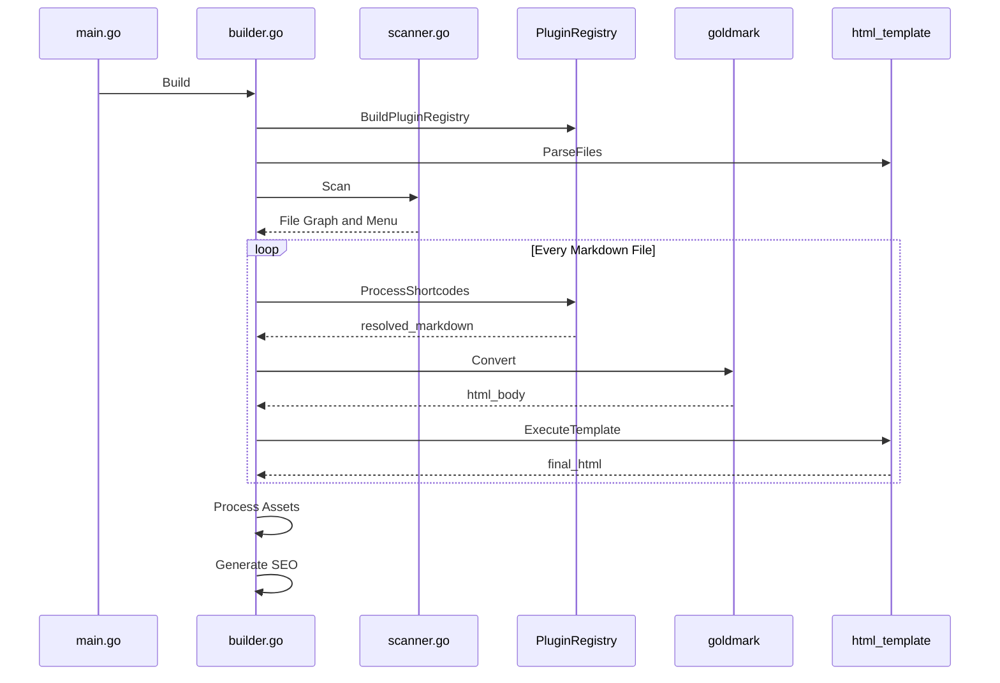
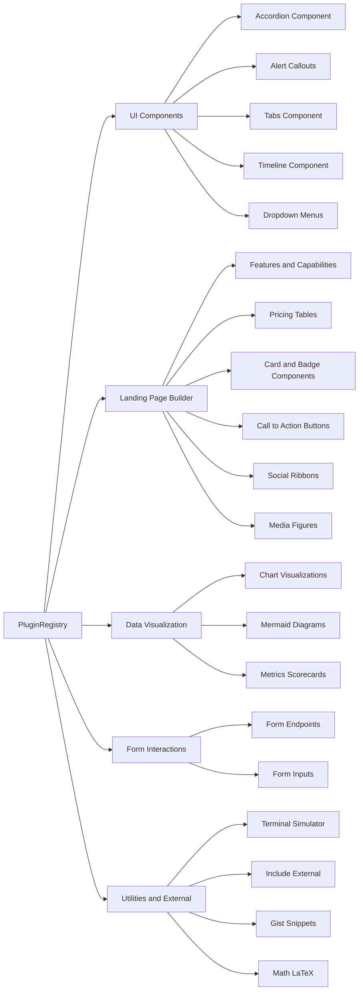

<div align="center">
  
  <h1>Tamarind: Enterprise Static Engine</h1>
  <p><b>The Agent-Native, Zero-Dependency Publishing Pipeline.</b></p>
  <a href="https://usetamarind.com">usetamarind.com</a>
</div>

---

## 1. Executive Summary

Tamarind is an enterprise-grade, blazing-fast static site engine written entirely in Go. Designed for absolute stability, it completely eliminates the `node_modules` black hole, Webpack configuration hell, and complex JavaScript hydration pipelines. It is distributed as a **single, dependency-free binary**.

**Why Tamarind?**
* **Instantaneous Compilation:** Compiles thousands of markdown pages into production-ready HTML in milliseconds via multi-core goroutine execution.
* **Agent-Native:** The first web framework explicitly designed to be operated by AI. Install, build, and deploy entire sites using our natural-language Agent Prompts.
* **Theme-Aware Ecosystem:** Shipped with 31+ embedded, premium aesthetic themes built into the compiler binary, enforcing strict color-contrast rules and UI layout consistency.
* **Zero Infrastructure:** No databases. No external packages. Pure, secure static file output ready for immediate S3/CDN deployment.

## 2. High-Level Compilation Lifecycle

Tamarind operates as a strict, deterministic compilation pipeline. The build process ingests raw markdown, resolves complex extensible shortcodes via the Plugin Registry, and emits pristine, optimized HTML.



## 3. The Plugin Registry (OCP Compliant)

Tamarind implements a strictly decoupled `PluginRegistry` architecture following the Open-Closed Principle (OCP). All UI components are injected dynamically as atomic Go packages into the markdown rendering pipeline. This ensures that the core compiler remains perfectly isolated.

### Plugin Hierarchy



## 4. The Data Model

As the scanner reads the file system, it populates shared data structs. The primary composite structure injected into the HTML templates is `PageData`. Templates access these variables directly using Go template syntax.

```mermaid
classDiagram
    class PageData {
        +String Title
        +String Subtitle
        +String Description
        +String Body
        +List Articles
        +List Menu
        +Map Data
        +Paginator Paginator
        +List ContextualSidebar
    }
    class ArticleMeta {
        +String Title
        +String Date
        +String URL
        +List Tags
        +String Author
    }
    class MenuItem {
        +String Title
        +String URL
        +int Order
    }
    class Paginator {
        +int CurrentPage
        +int TotalPages
        +List VisiblePages
    }
    class PageLink {
        +int Number
        +String URL
        +bool IsCurrent
    }
    class SidebarItem {
        +String Title
        +String URL
        +bool IsCurrent
    }
    PageData *-- ArticleMeta : Composes
    PageData *-- MenuItem : Composes
    PageData *-- Paginator : Composes
    PageData *-- SidebarItem : Composes
    Paginator *-- PageLink : Composes
```



## 5. Advanced Capabilities (The "Dev Spice")

### 📈 Embedded Data Visualization
No need for external charting libraries like Chart.js or D3. Tamarind parses raw data structures from markdown and natively compiles them into interactive, SVG-based Bar, Line, Pie, and Grouped Bar charts.

### 💻 Time to Hello World < 3 Seconds
Extract the entire `writer-sandbox` default structure instantly via the `go:embed` virtual filesystem. Tamarind requires exactly zero configuration files to start rendering beautiful documentation and landing pages.

### 🎨 Guaranteed Contrast Ratios
Our internal stylesheet compilation engine dynamically injects CSS variables globally across the site, ensuring that all 31 embedded themes exceed WCAG AAA accessibility standards regardless of dark/light mode toggling.

---

## 6. Agent-Native Installation

We have completely removed the friction of manual environment setup. You can deploy Tamarind simply by instructing your AI agent.

### Option A: The AI Prompt (Recommended)
Copy and paste this into your LLM (Cursor, Antigravity, GitHub Copilot):

```text
@agent: Please download and read the Tamarind master skill file from https://tamarind.dev/skills/tamarind-master.txt. Follow its instructions to install Tamarind on my machine, initialize a new workspace in a folder called 'my-site', and build it.
```

Your agent will automatically download the binary, initialize the workspace, and teach itself how to use Tamarind's premium components via the skills matrix.

### Option B: Manual Compilation (For Traditionalists)

```bash
# 1. Clone the repository
git clone https://github.com/rsantiago/tamarind.git
cd tamarind

# 2. Build the dependency-free Go binary
make build

# 3. Initialize a new sandbox and serve locally
./tamarind init
./tamarind serve -theme zephyr
```

---

## 7. Licensing & Governance

Tamarind is distributed under the **Business Source License (BSL 1.1)**. It is free for non-production use and open for code inspection, but strictly protected against unauthorized commercial exploitation and SaaS repackaging.

*Cultivated with absolute precision by @rsantiago.*
