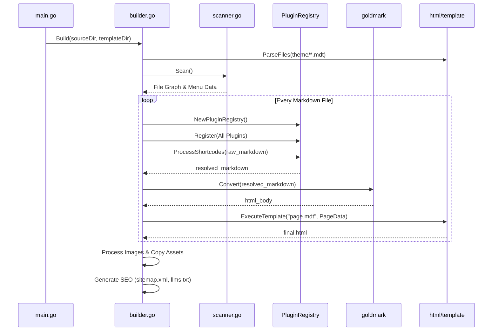
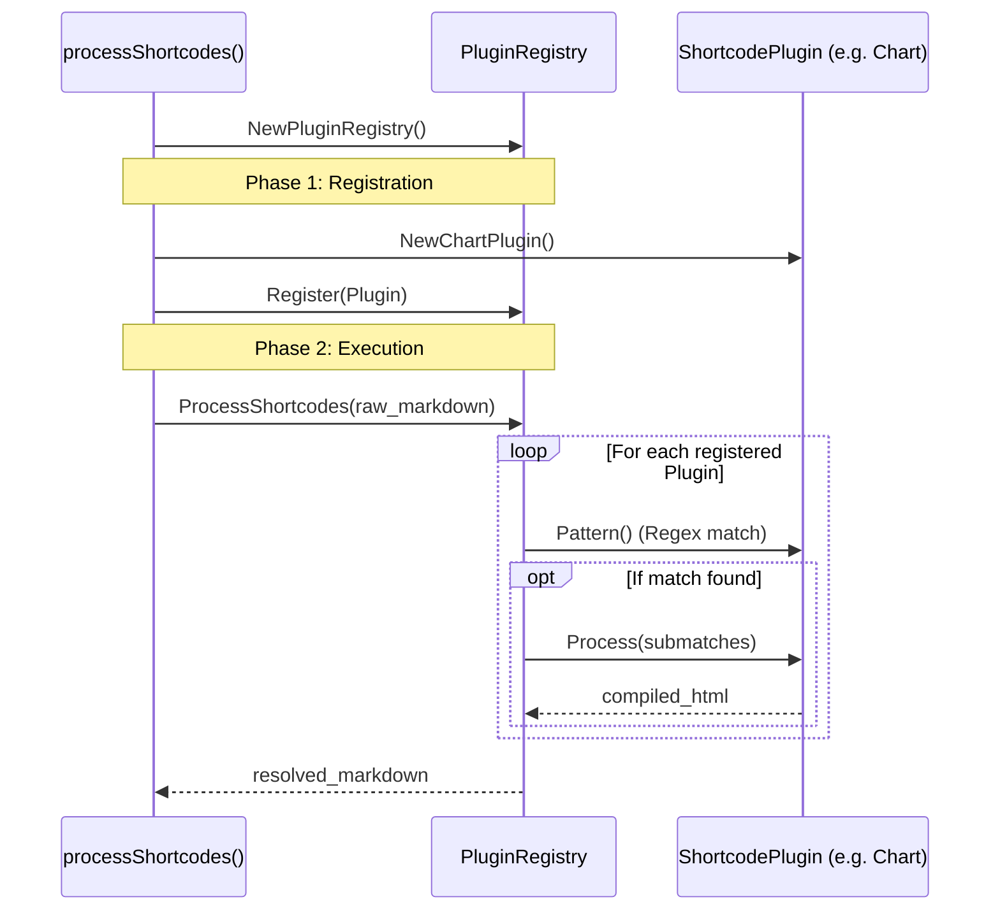
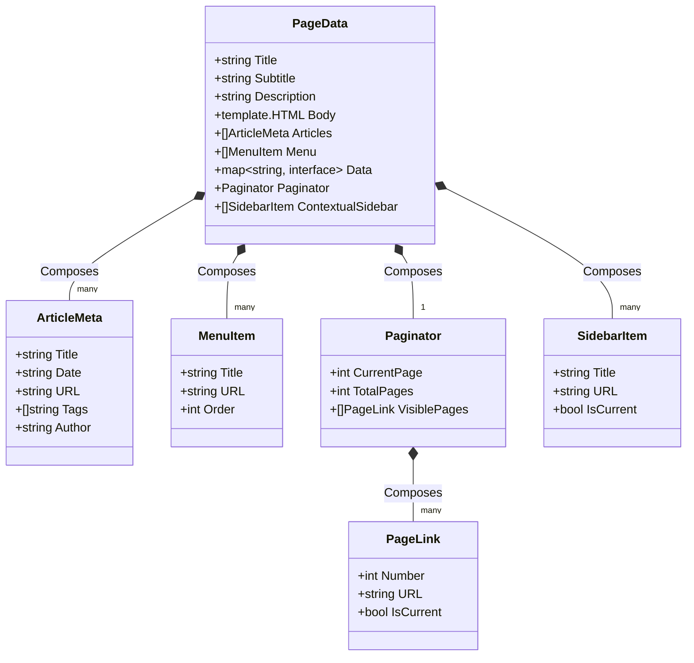

# Tamarind System Architecture

Tamarind is a highly optimized, zero-dependency Static Site Generator (SSG) built in Go. It is designed as a high-performance pipeline that ingests raw markdown, resolves complex extensible shortcodes, and emits pristine, optimized HTML.

This document serves as a technical overview for developers, theme designers, and open-source contributors looking to understand how Tamarind operates under the hood.

---

## 1. High-Level Compilation Lifecycle

The build process is orchestrated entirely within the `parser/internal/builder` package and operates in a strict, deterministic sequence.

### End-to-End Build Sequence
The following sequence diagram illustrates the call stack and interactions between the major internal systems from the moment the compiler starts:



---

## 2. Directory Structure

The repository is modularized to strictly separate the compiler engine from the themes and templates.

```text
parser/
├── main.go                     # CLI entry point (build, serve, update)
├── assets/                     # Packaged via go:embed natively into the binary
│   ├── structure/              # Default scaffold for 'tamarind init'
│   └── templates/              # Core HTML/CSS templates for all built-in themes
├── internal/
│   ├── builder/                # The core build engine and shortcode plugins
│   ├── config/                 # YAML configuration parser
│   ├── models/                 # Shared data structures (PageData, ArticleMeta)
│   ├── seo/                    # XML sitemap and robots generator
│   ├── server/                 # Local development server
│   └── updater/                # OTA self-update mechanism
```

---

## 3. The `go:embed` Virtual Filesystem

Tamarind compiles to a **single static binary**. To achieve this without requiring users to download external dependencies, the entire `assets/` directory is baked directly into the executable using Go's native `embed` package. 

When a user runs `tamarind init`, the CLI reads the embedded `assets/structure/` directory and hydrates a new project scaffold instantly on their local filesystem. Similarly, theme templates are read directly from memory during the build process, ensuring blisteringly fast IO.

---

## 4. The Shortcode & Plugin Registry

Tamarind features a highly extensible shortcode system. Instead of relying on a monolithic parser, specialized components are registered as isolated "Plugins." 

Located in `internal/builder/registry.go`, the `PluginRegistry` evaluates custom shortcodes like `{{!}}{ barchart }}` and replaces them with HTML outputs *before* standard markdown parsing happens.

### Plugin Hierarchy
Here is the current ecosystem of native Tamarind plugins:

```mermaid
graph TD
    PR[PluginRegistry] --> UI[UI Components]
    PR --> DataVis[Data Visualization]
    PR --> Form[Form Interactions]
    PR --> Utilities[Utilities & External]

    UI --> Accordion[Accordion: Expandable sections]
    UI --> Alert[Alert: Contextual callouts]
    UI --> Tabs[Tabs: Tabbed content]
    UI --> Timeline[Timeline: Vertical history]

    DataVis --> Chart[Chart: Bar, Pie, Line, Radar]
    DataVis --> Mermaid[Mermaid: Diagram rendering]
    DataVis --> Metrics[Metrics: KPI scorecards]
    
    Form --> FormContainer[Form: Contact endpoints]
    Form --> Inputs[Inputs: Text, Select, Checkbox]

    Utilities --> Terminal[Terminal: Shell simulation]
    Utilities --> Include[Include: Embed external files]
    Utilities --> Gist[Gist: GitHub snippets]
    Utilities --> Math[Math: LaTeX rendering]
```



### Component Isolation
Every feature is encapsulated in its own file (e.g., `plugin_chart.go`, `plugin_tabs.go`, `plugin_terminal.go`). This ensures that if a specific component needs a bug fix, the rest of the compilation pipeline remains entirely untouched.

### Registry Lifecycle
The following sequence diagram outlines exactly how the registry is instantiated, populated, and executed against a Markdown string:



---

## 5. The Data Model

As the scanner reads the file system, it populates shared structs defined in `internal/models/models.go`. 

The primary composite structure injected into the HTML templates is `PageData`. Templates (like `page.mdt`) access these variables directly using Go template syntax (e.g., `{{!}}{ .Title }}` and `{{!}}{ .Body }}`).

### Class Hierarchy Diagram
The following diagram maps the exact composition of the data injected into the Go template renderer:



---

## 6. Development Server

Tamarind ships with a built-in static server (`tamarind serve`). It mounts the target output directory (usually `website/` or `public/`) to a local port. 

Currently, the server is optimized for static file delivery. When making changes to markdown files or the theme, you must rebuild the site using `tamarind build` to reflect the updates.
